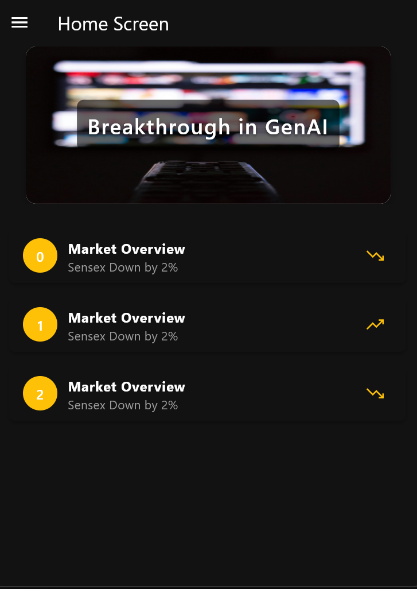
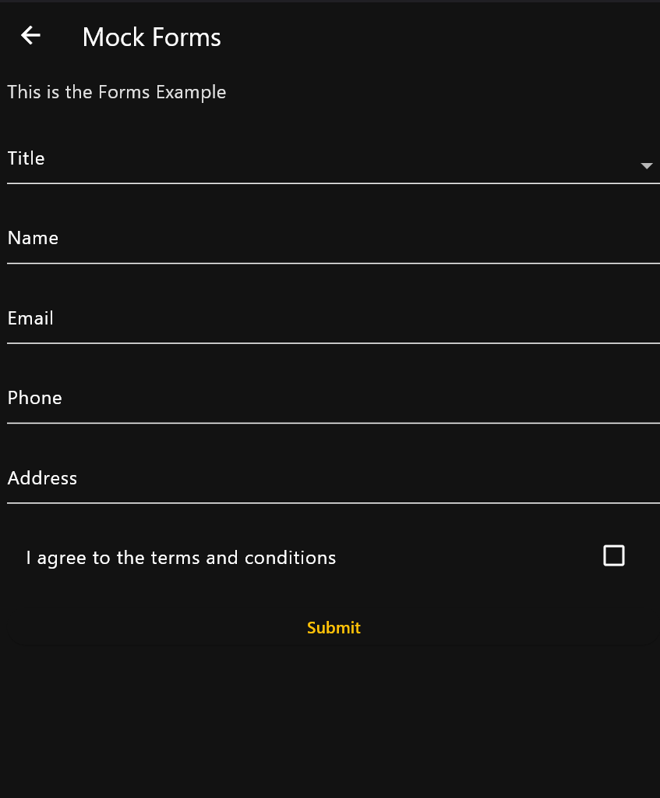
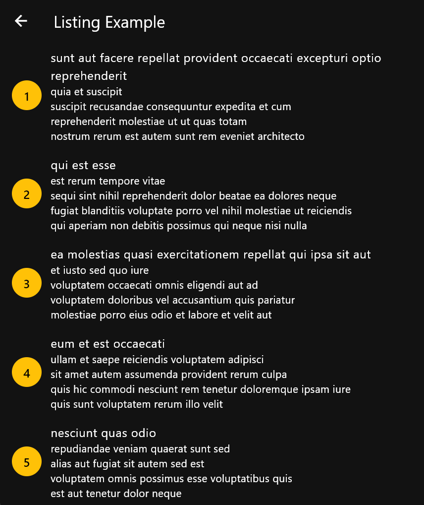

# 🚀 flutter-app-gen

A proof-of-concept Flutter framework that renders entire apps from a single JSON configuration. Inspired by Server-Driven UI (SDUI) principles, this project enables you to define screens, components, themes, navigation, and state — all from a remotely or locally fetched JSON file.

---

## 📸 Screenshots

| Home Screen (Carousel + List) | Form Example | Remote Listing |Theme |
|-------------------------------|---------------|----------------|
|  |  |  | |

---

## 🧩 How It Works

At runtime, the app reads a JSON configuration (`appDataConfig`) that defines:

- **App metadata**: name, version  
- **Theme**: colors, dark mode support  
- **Navigation**: routes, drawer items  
- **Screens**: types (`base`, `form`, `listing`), their UI components and state  
- **Initial Actions**: like `fetch` to populate data before render  

The app renders a full working UI from this structure — **no manual coding required per screen**.

---

## 🔧 Supported Component Types (via JSON)

- `carousel`: Image/text carousels  
- `list`: Lists with icons, stats, or remote data  
- `text`: Static content  
- `dropdown`, `input`, `checkbox`, `button`: Form elements  
- `centeredtext`: Center-aligned static text blocks  

---

## 🛠 Example Features (from Demo Config)

- Home screen with a **carousel** and a **list** populated from initial state  
- A **dynamic form screen** with multiple input fields and a submit button  
- A **remote list fetcher** using a GET API (`jsonplaceholder.typicode.com`)  
- A **custom theme**, with light/dark support  
- A **drawer menu** configured from JSON  

---

## 📁 Sample JSON Structure

```json
{
  "appName": "JDF DEMO APP",
  "appVersion": "1.0.0",
  "themeConfig": {
    "primaryColor": "#FFC107",
    "secondaryColor": "#FFC107",
    "backgroundColor": "#F5F5F5",
    "textColor": "#212121",
    "isDarkMode": false,
    "darkTheme": {"backgroundColor": "#121212", "textColor": "#E0E0E0"},
  },
  "intialRoute": "/home",
  "routes": ["/home", "/details", "/listing"
  ],
  "screens": [
    {
      "title": "Home Screen",
      "key": "home_screen",
      "routeName": "/home",
      "type": "base",
      "components": [
        {
          "type": "carousel",
          "params": {"dataKey": "carouselData"},
        },
        {
          "type": "list",
          "params": {"dataKey": "data"},
        },
      ],
      "initialState": {
        "carouselData": [
          {
            "text": "Sensex Down by 2%",
            "image":
                "https://images.unsplash.com/photo-1444653614773-995cb1ef9efa?q=80&w=2076&auto=format&fit=crop&ixlib=rb-4.1.0&ixid=M3wxMjA3fDB8MHxwaG90by1wYWdlfHx8fGVufDB8fHx8fA%3D%3D",
          },
          {
            "text": "Breakthrough in GenAI",
            "image":
                "https://images.unsplash.com/photo-1538131587570-641359811581?q=80&w=2155&auto=format&fit=crop&ixlib=rb-4.1.0&ixid=M3wxMjA3fDB8MHxwaG90by1wYWdlfHx8fGVufDB8fHx8fA%3D%3D",
          },
        ],
        "data": [
          {
            "title": "Market Overview",
            "icon": "trending_down",
            "stats": "Sensex Down by 2%",
          },
          {
            "title": "Market Overview",
            "icon": "trending_up",
            "stats": "Sensex Down by 2%",
          },
          {
            "title": "Market Overview",
            "icon": "trending_down",
            "stats": "Sensex Down by 2%",
          },
        ],
      },
      "intialAction": {},
      "drawerConfig": {
        "config": {
          "drawerItems": [
            {"title": "Home", "icon": "home", "route": "/home"},
            {"title": "Details", "icon": "info", "route": "/details"},
            {"title": "Listing", "icon": "info", "route": "/listing"}
          ],
        },
      },
    },
    {
      "title": "Mock Forms",
      "key": "details_screen",
      "routeName": "/details",
      "type": "form",
      "components": [
        {
          "type": "text",
          "params": {"content": "This is the Forms Example"},
        },
        {
          "type": "dropdown",
          "params": {
            "label": "Title",
            "options": [
              {"label": "Mr", "value": "mr"},
              {"label": "Mrs", "value": "mrs"},
              {"label": "Ms", "value": "ms"},
            ],
            "placeholder": "Select your title",
            "dataKey": "title",
          },
        },
        {
          "type": "input",
          "params": {
            "label": "Name",
            "placeholder": "Enter your name",
            "dataKey": "name",
          },
        },
        {
          "type": "input",
          "params": {
            "label": "Email",
            "placeholder": "Enter your email",
            "dataKey": "email",
          },
        },
        {
          "type": "input",
          "params": {
            "label": "Phone",
            "placeholder": "Enter your phone",
            "dataKey": "phone",
          },
        },
        {
          "type": "input",
          "params": {
            "label": "Address",
            "placeholder": "Enter your address",
            "dataKey": "address",
          },
        },
        {
          "type": "checkbox",
          "params": {
            "label": "I agree to the terms and conditions",
            "dataKey": "terms",
          },
        },
        {
          "type": "button",
          "params": {"label": "Submit", "action": "submit"},
        },
      ],
      "initialState": {
        "formData": {
          "title": "",
          "name": "",
          "email": "",
          "phone": "",
          "address": "",
          "terms": false,
        },
      },
      "intialAction": {},
      "drawerConfig": null,
    },
    {
      "title": "Listing Example",
      "key": "listing1",
      "routeName": "/listing",
      "type": "listing",
      "components": [
        {
          "type": "list",
          "params": {
            "dataKey": "data",
            "itemExtractor": {"title": "title", "subtitle": "body", "id": "id"},
          },
        },
      ],
      "initialState": {"data": []},
      "intialAction": {
        "type": "fetch",
        "url": "https://jsonplaceholder.typicode.com/posts",
        "method": "GET",
        "dataKey": "data",
      },
      "drawerConfig": null,
    }
  ],
}
